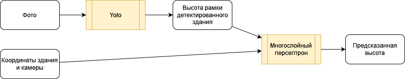

### Описание датасета
В папке train предоставлен датасет, на котором была обучена модель.
|filename|building|camera|height|
|:-|:-|:-|:-|
|Наименование файла с фотографией здания|(x, y) координаты здания|(x, y) координаты камеры|Высота здания в метрах
### Описание модели
Архитектура модели имеет следующий вид:

Yolo была дополнительно предобучена на датасете с размеченными зданиями. Многослойный перцептрон был обучен с одним слоем дроп-аута.